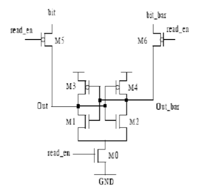
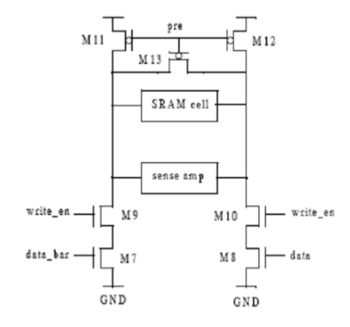
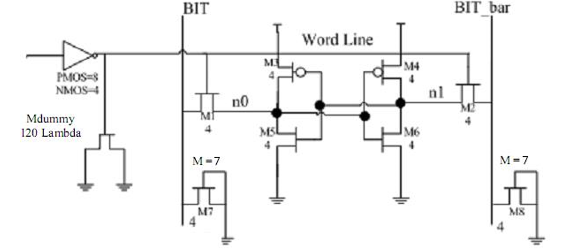

# 512-Bit-SRAM
Design of an 512-Bit SRAM using Cadence

## Requirement

The SRAM architecture is shown below,

The SRAM had two main components.  
1. Sense Amplifier  

2. Write data path  

  

One bit SRAM,

PIN specification

---

## Approach
To achieve this, we started out by designing the smaller parts using metal 1. Metal 2 was used when designing the 128-bit SRAM cell.
To achieve the 512-bit design, we then connected four 128-bit SRAM cell using metal 3 to achieve the complete design.

## Layouts

Here are some of the important layouts of the design

1. Sense Amplifier

a. Cell  

b. Unit

2. Write Circuit

a. Cell

  

b. Unit  

3. Pre-charge circuit

4. 6 transistor design of SRAM

5. Row decoder

6. Write multiplexer

7. Read Multiplexer

8. Register Bank select

9. 512-Bit SRAM

a. Schematic

b. Layout

----

## Files

The files attached here contain a vector file with HSPICE code to simulate the design. Individual schematics of each cell and unit have 
also been attached. They can be found in the "Images" folder.
